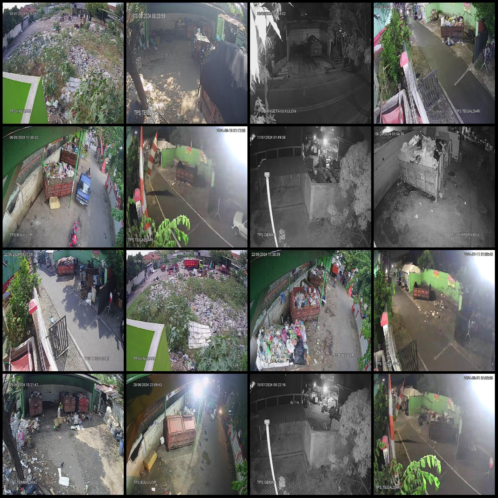
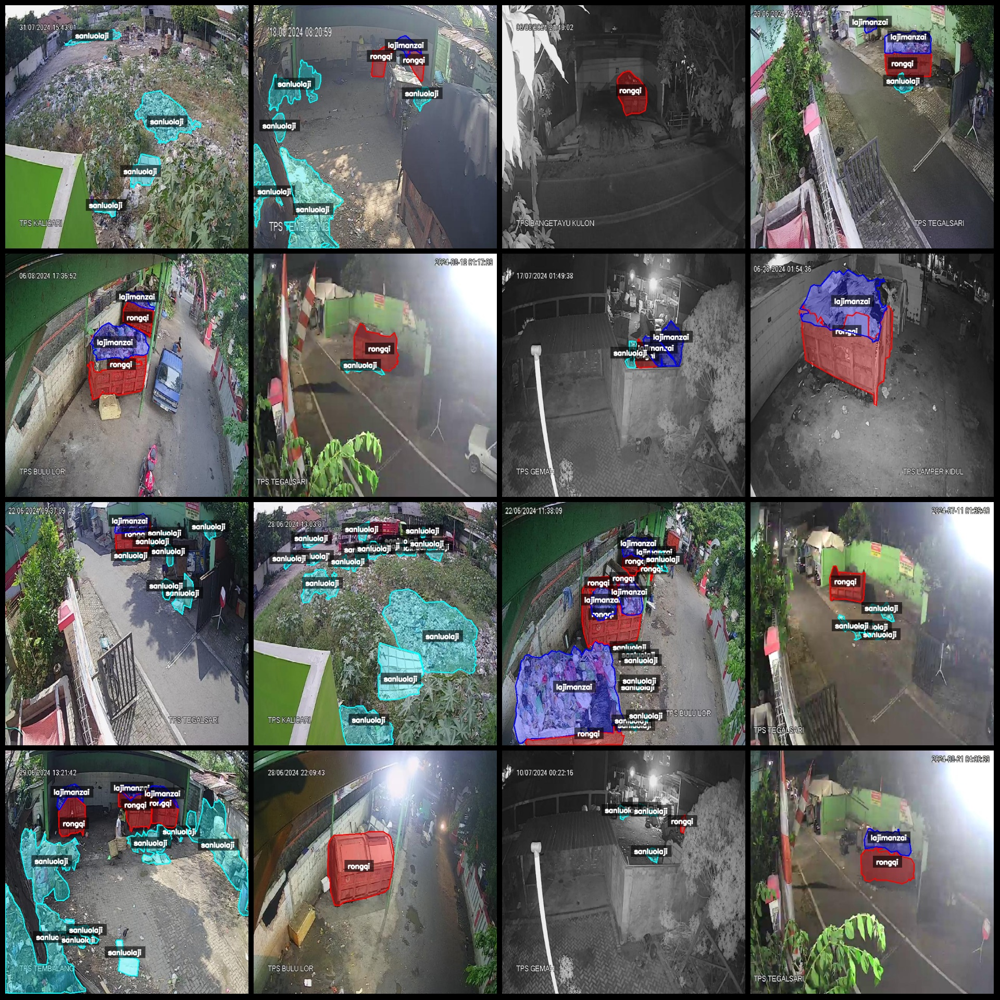
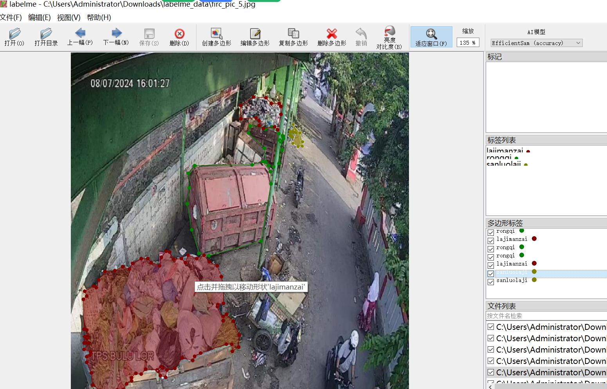

# Waste Station Monitoring and Waste Recycling Site Monitoring and Identification Segmentation Dataset in LabelMe Format with 7541 Images of 3 Categories

Dataset Format: LabelMe format (excluding mask files, only including JPG images and corresponding JSON files)
Number of Image Files: 7541
Number of Annotations: 7541
Number of Annotation Categories: 3
Annotation Category Names: ["lajimanzai", "rongqi", "sanluolaji"]
Each Category Number of Boxes:
- lajimanzai (Garbage Full) count = 6656
- rongqi (Garbage Bin) count = 13216
- sanluolaji (Scattered Garbage) count = 21216
Total Boxes: 41088
Using Annotation Tool: labelme=5.5.0
Image Resolution: 640x640
Annotation Rules: Polygon box is drawn around categories
Important Notice: The dataset can be edited in LabelMe, and the JSON dataset needs to be converted into mask or Yolo or COCO format for semantic segmentation or instance segmentation.
Special Notice: This dataset does not guarantee the accuracy of the trained model or weight files.
Image Preview:
Annotation Example:
Original Images (randomly selected 16):
Annotation Drawing Results:
LabelMe Editing Example Image:

## Image

Here is a pay link on Stripe ( https://buy.stripe.com/3cs8yP7sY87d0vu9AB ). Please contact me lonlonago@foxmail.com after funding $89, and I will send you a complete data files , thank you!

